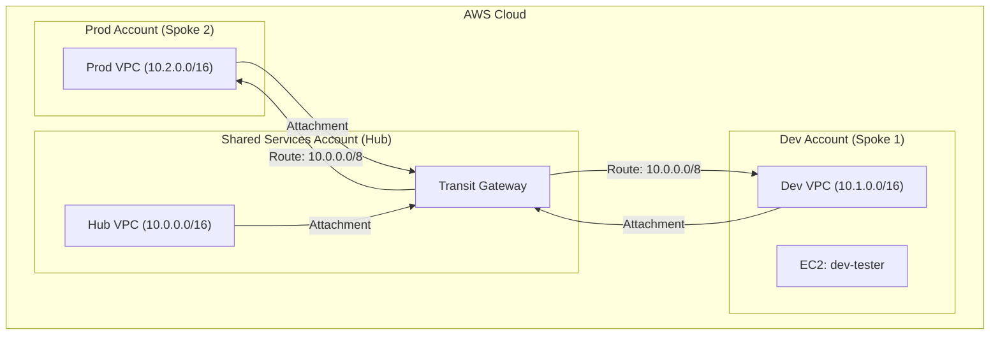

# ☁️ AWS Enterprise Landing Zone 2.0 (Hub & Spoke)

  

**Architect:** Abhii Bansal  
**Architecture:** Hub-and-Spoke Network with Transit Gateway  
**CI/CD:** GitHub Actions

---

## **1. Executive Summary**
This project implements a scalable **Hub-and-Spoke network architecture** on AWS. It demonstrates how to manage a Multi-Account environment using **Infrastructure as Code (IaC)**.

* **The Goal:** Enable secure communication between isolated business units (Dev, Prod) through a central inspection point (Shared Services).
* **The Method:** All infrastructure is managed via **GitOps**. Changes are proposed via Pull Requests, validated by Terraform Plans, and applied automatically upon merge.

---

## **2. Architecture Diagram**

    Traffic Flow: Dev ↔️ Transit Gateway ↔️ Prod

Security: Strict isolation between accounts; shared resources controlled via AWS RAM.

3. Project Components
A. Network Layer (The Foundation)

Component,Resource File,Description
The Hub,network.tf,Tier-1 VPC in Shared Services with Public/Private subnets.
The Router,transit-gateway.tf,Central Transit Gateway shared via AWS RAM to the Organization.
The Spokes,spoke-networks.tf,Isolated VPCs in Dev and Prod accounts using specific Provider Aliases.
The Wiring,network-attachments.tf,Cross-account TGW attachments linking Spokes to the Hub.

B. Routing Layer (The Logic)
Component,Resource File,Description
GPS,network-routes.tf,Routes 10.0.0.0/8 traffic from all Private Subnets to the Transit Gateway.

C. Automation & Identity
Terraform: Uses provider aliases to manage 3 AWS accounts simultaneously from one codebase.

GitHub Actions: OIDC-federated IAM Roles allow CI/CD to deploy without long-term access keys.

4. Deployment History
This project was built in 7 Phases:

✅ Phase 1: Setup Terraform Backend (S3 + DynamoDB) & Providers.

✅ Phase 2: Build the Hub Network.

✅ Phase 3: Deploy & Share the Transit Gateway.

✅ Phase 4: Build Spoke Networks (Dev/Prod).

✅ Phase 5: Attach Spokes to Transit Gateway.

✅ Phase 6: Configure Network Routing tables.

✅ Phase 7: Verification (Ping Test: 0% Packet Loss).

5. How to Deploy
To replicate this infrastructure:

Clone the Repo: git clone <repo-url>

Configure Credentials: Update providers.tf with your Account IDs.

Initialize: terraform init

Plan & Apply: Run via GitHub Actions or locally.

Documentation generated by Abhii Bansal